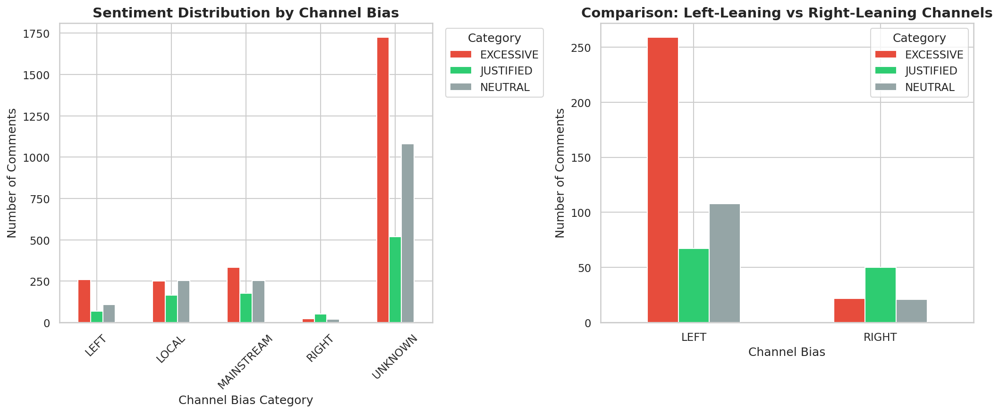

# 📊 Renee Good Shooting: Public Sentiment & Framing Analysis

> **Note:** This project analyzes public perception of the January 2026 Renee Good ICE shooting using Large Language Models (Llama 3 via Groq) to classify sentiment and media framing.

## 🌟 Highlights
* **5,285** comments analyzed across the entire political spectrum.
* **Zero-shot classification** pipeline using Groq API (Llama 3 70B).
* **Pivoted Strategy:** Successfully migrated from Reddit to YouTube Data API to bypass rate limits while maintaining channel bias diversity.
* **Key Finding:** 63% of all discourse focuses on "Conflict," overshadowing "Legality" (14%) or "Morality" (23%).

## ℹ️ Overview
This project aims to evaluate in what way does public perception on social media align with or diverges from official state narratives regarding the Renee Good shooting in Minneapolis.

Originally designed for Reddit, we de-risked our data collection strategy by pivoting to **YouTube**, scraping comments from three specific media layers:
1.  **Local News:** (Local Minneapolis outlets)
2.  **Mainstream:** ( CNN, ABC etc.)
3.  **Partisan Hubs:** (Left and Right leaning political commentary channels)

We used **Llama 3 70B** to tag every youtube comment for **Sentiment** (Justified/Excessive/Neutral) as well as **Framing** (Moral/Conflict/Legal).

## 📉 Visuals & Results
Our analysis revealed a massive polarization in sentiment, and a shared focus on political conflict over substance.

### 1. Sentiment by Political Bias
*Right-leaning channels (green) overwhelmingly view the action as "Justified," while Left and Mainstream channels lean heavily toward "Excessive."*


### 2. Framing Analysis
*The "Conflict" frame (orange) dominates 63% of the conversation. Users are fighting **about** the event rather than discussing the legal implications.*


## 🛠️ Usage
To reproduce our analysis:

1.  **Clone the repo:**
    ```bash
    git clone [https://github.com/your-username/renee-good-analysis.git](https://github.com/your-username/renee-good-analysis.git)
    ```
2.  **Install dependencies:**
    ```bash
    pip install -r requirements.txt
    ```
3.  **Run the pipeline:**
    ```bash
    python collect_data.py   # Scrapes YouTube comments
    python analyze.py        # Classifies using Groq/Llama3
    python visualize.py      # Generates the charts in /charts
    ```

## 👥 Team
* Han Myrda
* Mateusz Maciejewski
* Emil Höijer
